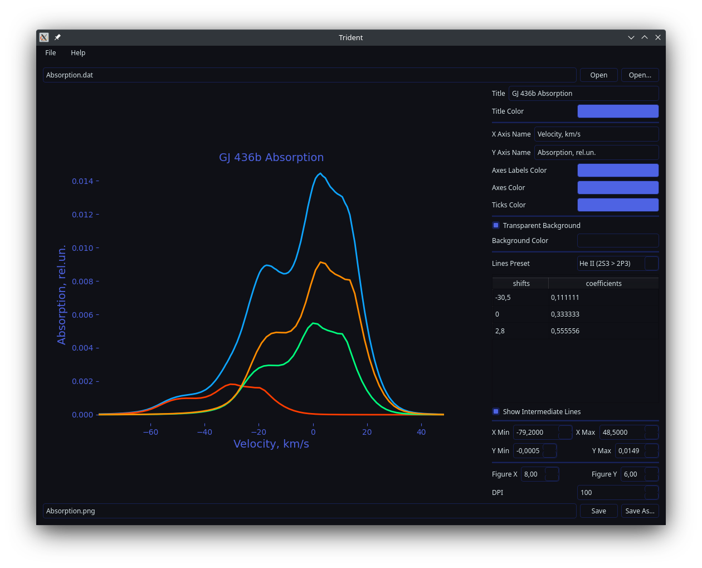

# Trident

## Description

Trident is a program with graphical user interface for transforming singlet absorption lines to triplets and visualizing them.



Compatible file format for parsing (commonly named as "Absorption.dat"):

```
VV FullAbs ResPart Thermal
<float> <float> <float> <float>
<...> <...> <...> <...>
```

## Installation

### Method 1: Python Package (GNU/Linux, Windows)

If you want to install Trident as independent application, it is recommended to use [pipx](https://pypa.github.io/pipx/).

```sh
pipx install https://github.com/deverte/trident/releases/download/v0.1.0/trident-0.1.0-py3-none-any.whl
```

> Additionally, you can create application shortcut:
> On GNU/Linux (XDG-compatible desktop environment) run:
> ```sh
> echo "[Desktop Entry]\nName=Trident\nExec=$PIPX_BIN_DIR/trident\nType=Application\nTerminal=false" > ~/.local/share/applications/Trident.desktop; cp ~/.local/share/applications/Trident.desktop ~/Desktop
> ```
> On Windows run (use PowerShell):
> ```sh
> $shortcut = (New-Object -COM WScript.Shell).CreateShortcut('$env:UserProfile\Desktop\Trident.lnk'); $shortcut.TargetPath='$env:PIPX_BIN_DIR\trident.exe'; $shortcut.Save()
> ```

But you can also install Trident using [pip](https://pip.pypa.io/en/stable/) by the same way.

> Application shortcut creation instruction:
> On GNU/Linux (XDG-compatible desktop environment) run:
> ```sh
> echo "[Desktop Entry]\nName=Trident\nExec=python -m trident\nType=Application\nTerminal=false" > ~/.local/share/applications/Trident.desktop; cp ~/.local/share/applications/Trident.desktop ~/Desktop
> ```
> On Windows run (use PowerShell):
> ```sh
> $shortcut = (New-Object -COM WScript.Shell).CreateShortcut('$env:UserProfile\Desktop\Trident.lnk'); $shortcut.TargetPath='python.exe -m trident'; $shortcut.Save()
> ```

### Method 2: Scoop (Windows)

To install Trident with [Scoop](https://scoop.sh/), you can add repo and install this program.

```sh
scoop bucket add shell https://github.com/deverte/scoop-shell
```

```sh
scoop install trident
```

### Method 3: Download (Windows)

Also you can [download](https://github.com/deverte/trident/releases) a single executable file (`trident.exe`) and use it like portable program.

## Dependencies

- [Matplotlib](https://matplotlib.org/)
- [pandas](https://pandas.pydata.org/)
- [PyQt](https://www.riverbankcomputing.com/software/pyqt/intro)

## Build Instructions

Development requires:

1. [Poetry](https://python-poetry.org/).
2. [7-Zip](https://www.7-zip.org/) (optional, for Windows Scoop package creation).
3. [git](https://git-scm.com/) (optional, but recommended).

First steps:

1. Download Trident sources:
    ```sh
    git clone https://github.com/deverte/trident
    ```
2. Install dependencies:
    ```sh
    poetry install
    ```

> If styles are updated, it's also needed to preprocess the `scss` file:
> 
> ```sh
> poetry run pysassc style/dark_theme.scss trident/ui/dark_theme.qss
> ```

### Python Package

The following command will build a package as a sdist (source tarball) and a wheel (compiled):

```sh
poetry build
```

The resulting `trident-x.x.x-py3-none-any.whl` and `trident-x.x.x.tar.gz` packages will be in `dist` directory.

### Windows Executable

The following command will build a single portable executable:

```sh
poetry run pyinstaller -F --add-data "trident/ui/main.ui;trident/ui" --add-data "trident/ui/dark_theme.qss;trident/ui" --clean --noconfirm --windowed trident/__main__.py --name trident
```

The resulting `trident.exe` will be in `dist` directory.

> For the Scoop, it's also needed to compress the resulting `trident.exe` file into a zip archive.
>
> ```sh
> 7z a dist/trident.zip ./dist/trident.exe
> ```

## Testing Instructions

You can run application inside development environment with the following command:

```sh
poetry run python -B -m trident
```

## License

[GPLv3](LICENSE)